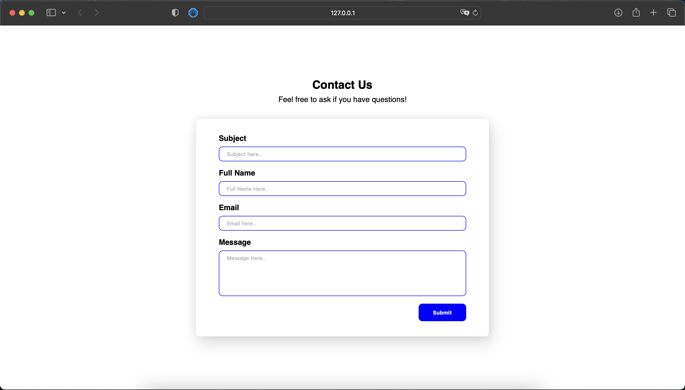

# Technology Project Member (TPM) by Bina Nusantara Computer Club (BNCC)
## TPM Front-End BNCC34 (TPM-FE-34)

### Introduction
- [ ] [BNCC](https://bncc.net/)
- [ ] [BINUS University](https://binus.ac.id/)

### Requirements
- [ ] [Git](https://git-scm.com/downloads)
- [ ] [Visual Studio Code](https://code.visualstudio.com/download)

### Extensions
- [ ] [Live Server](https://marketplace.visualstudio.com/items?itemName=ritwickdey.LiveServer)
- [ ] [Prettier - Code Formatter](https://marketplace.visualstudio.com/items?itemName=esbenp.prettier-vscode)
- [ ] [Auto Close Tag](https://marketplace.visualstudio.com/items?itemName=formulahendry.auto-close-tag)
- [ ] [Auto Rename Tag](https://marketplace.visualstudio.com/items?itemName=formulahendry.auto-rename-tag)

### Installation
- [ ] Clone this repository
```bash
git clone https://github.com/adzinzhalifunnas/TPM-FE-34.git
```

### Daftar Pertemuan
- [Pertemuan 1](#pertemuan-1)

### Pertemuan 1
- [ ] Topic: TPM FE
- [ ] Time: 15 December 2022, 21.20 WIB - 23.00 WIB
- [ ] Preview Screenshot


### Connect with Me
- [ ] [Personal Website](https://adzinz.com/)
- [ ] [GitHub](https://www.github.com/adzinzhalifunnas/)
- [ ] [GitLab](https://gitlab.com/dzinzh)
- [ ] [LinkedIn](https://www.linkedin.com/in/adzin-zhalifunnas/)
- [ ] [Instagram](https://www.instagram.com/adzinzh)
- [ ] [Twitter](https://www.twitter.com/adzinzh)
- [ ] [LINE](https://line.me/ti/p/~dzinz)
- [ ] [Telegram](https://t.me/adzinzh)